# Diagramming Standards

This document defines the standards for creating diagrams using Mermaid in Markdown. Visual diagrams are **REQUIRED** for documenting architecture, flows, and complex systems.

## Philosophy

Our diagramming approach prioritizes:

- **Plain text diagrams** — version controlled with code
- **Mermaid syntax** — renders in GitHub, editors, and documentation sites
- **Clarity over completeness** — show what matters, hide the rest
- **Living diagrams** — updated with code changes
- **Consistent style** — recognizable patterns across all diagrams

---

## Why Mermaid?

**RULE**: ALL diagrams MUST be created using Mermaid syntax in Markdown files.

### Benefits

- **Version Controlled**: Diagrams stored as text in Git
- **Reviewable**: Diagram changes visible in pull requests
- **Universal**: Renders on GitHub, GitLab, VS Code, IDEs
- **Maintainable**: Update text, rendering updates automatically
- **Searchable**: Find diagrams by searching text
- **No Special Tools**: Edit with any text editor

❌ **NEVER**:
- Use draw.io, Lucidchart, or other external tools
- Store diagrams as images (.png, .jpg, .svg exports)
- Keep diagrams in separate documents from code

✅ **ALWAYS**:
- Write diagrams in Mermaid syntax
- Store in `.md` files in `docs/diagrams/`
- Update diagrams with code changes
- Review diagrams in pull requests

---

## Diagram Types & When to Use

| Diagram Type | Purpose | When to Create |
|--------------|---------|----------------|
| System Context | Show system boundaries and external actors | New project, major architecture changes |
| Container | Show high-level tech containers and interactions | Microservices, multi-tier apps |
| Component | Show internal structure of a container | Complex services, new major features |
| Sequence | Show request/response flow through system | API endpoints, complex interactions |
| State Machine | Show entity states and transitions | Workflow modeling, business processes |
| ERD | Show database schema and relationships | Database changes, data modeling |
| Flowchart | Show decision logic and control flow | Algorithms, business rules |
| User Journey | Show user interactions and experience | New features, UX improvements |

---

## 1. System Context Diagrams (C4 Model Level 1)

**PURPOSE**: Show the big picture — your system and its external dependencies.

**WHEN**: Create at project start and update when adding external integrations.

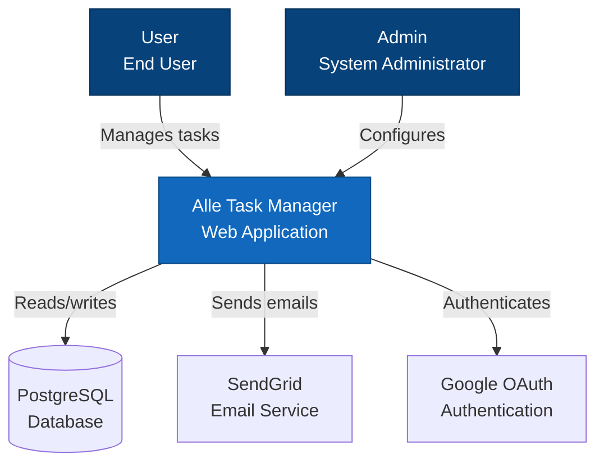

**Template**:
````markdown
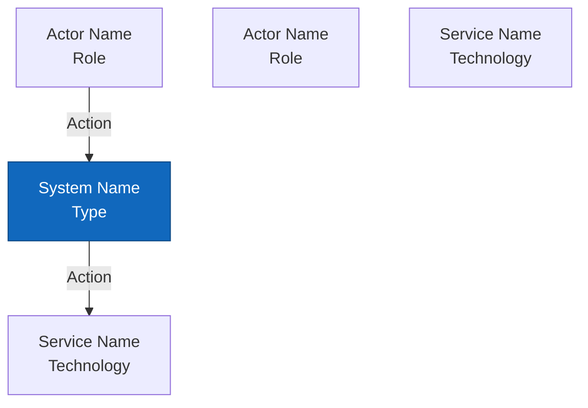
````

---

## 2. Container Diagrams (C4 Model Level 2)

**PURPOSE**: Show major containers (apps, services, databases) and how they interact.

**WHEN**: Multi-container architecture, microservices.

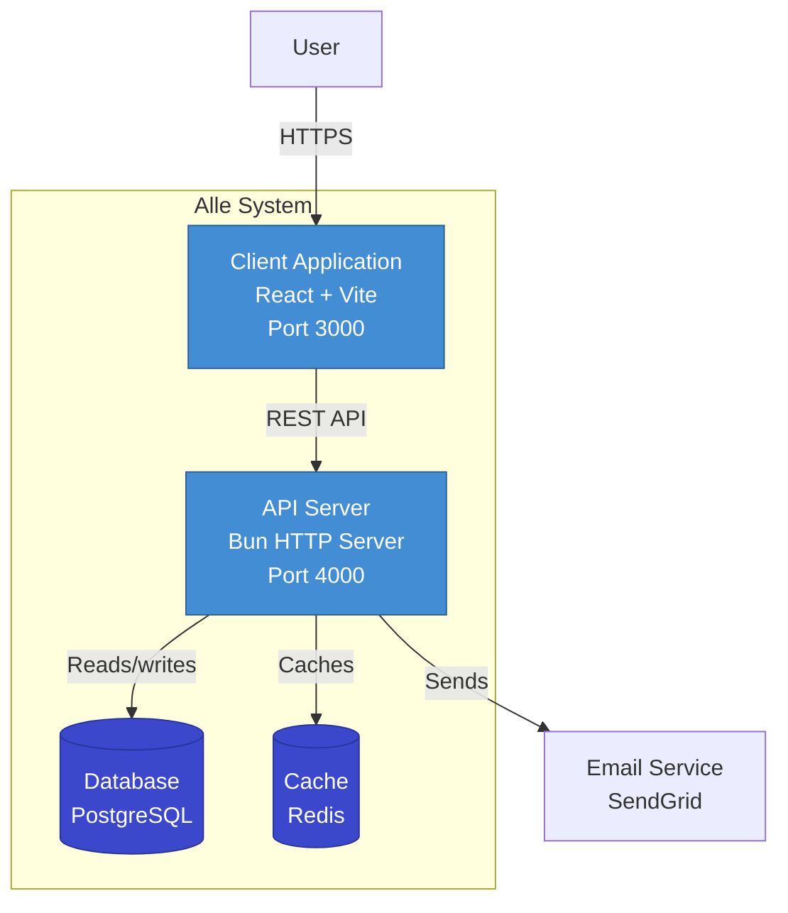

---

## 3. Component Diagrams (C4 Model Level 3)

**PURPOSE**: Show internal structure of a container (layers, components).

**WHEN**: Complex services, explaining internal architecture.

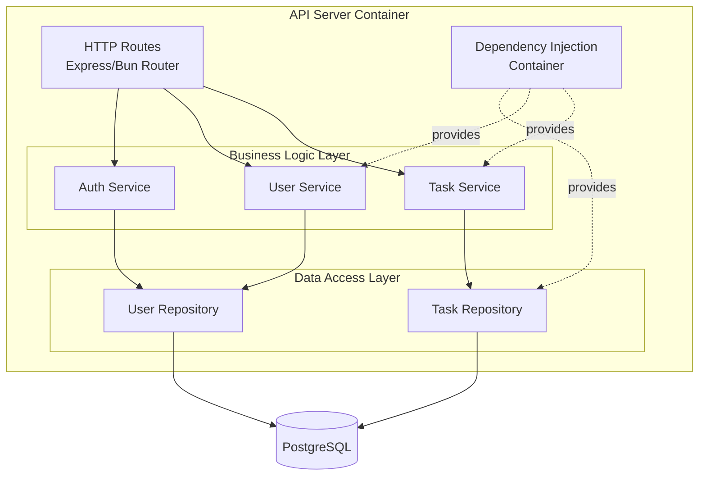

---

## 4. Sequence Diagrams (API Request Flow)

**PURPOSE**: Show step-by-step interaction between components over time.

**WHEN**: Documenting API endpoints, complex multi-step processes.

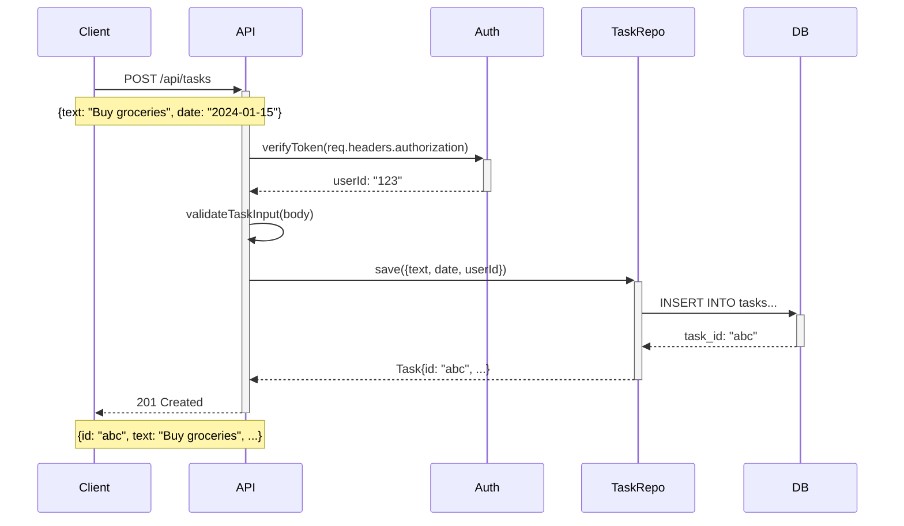

**Template**:
````markdown
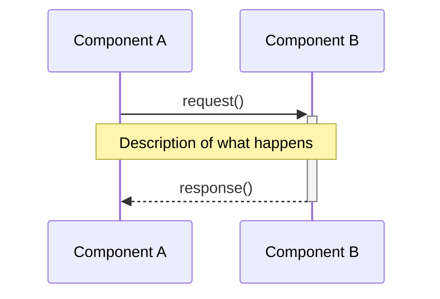
````

---

## 5. State Machine Diagrams

**PURPOSE**: Show entity states and valid transitions.

**WHEN**: Modeling workflows, order processing, user onboarding.

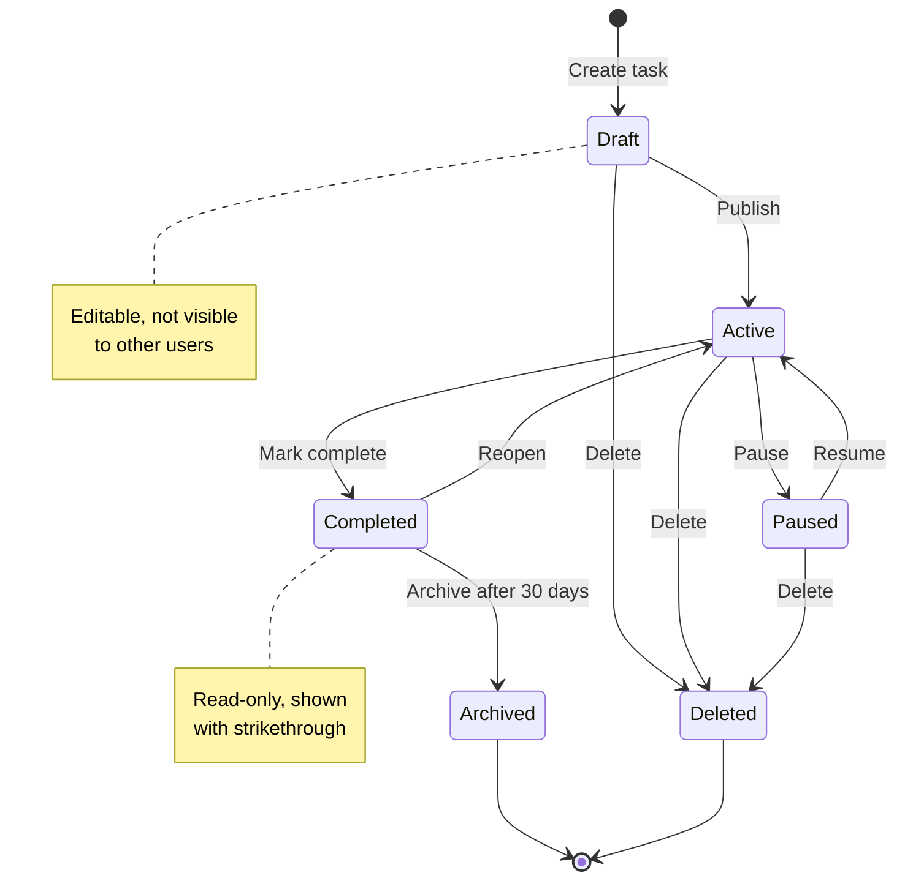

**Template**:
````markdown
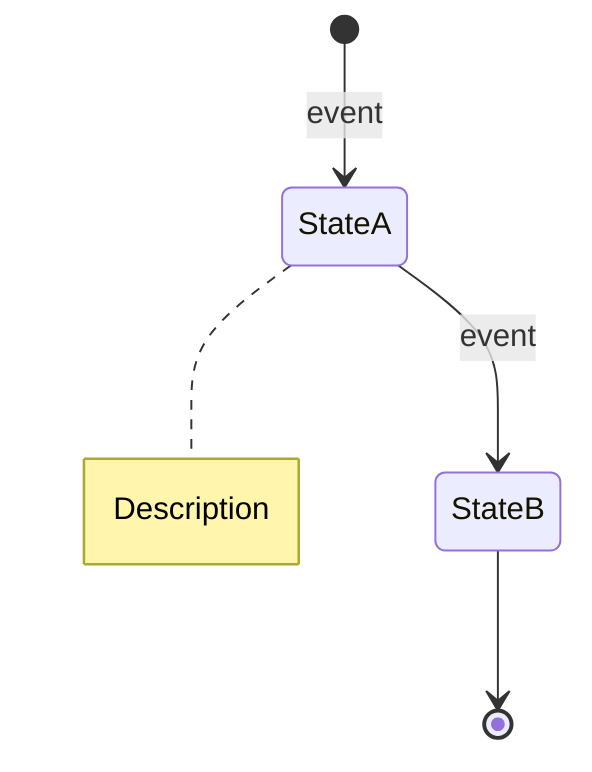
````

---

## 6. Entity Relationship Diagrams (ERD)

**PURPOSE**: Show database schema, tables, and relationships.

**WHEN**: Database design, schema changes, data modeling.

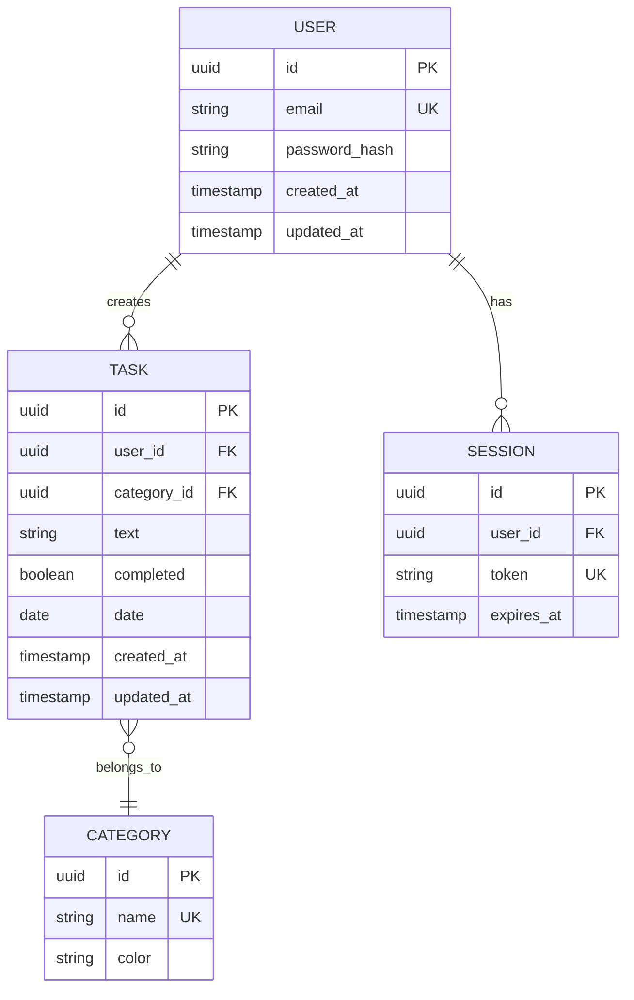

**Relationship Notation**:
- `||--o{` — One to zero or more
- `||--|{` — One to one or more
- `}o--||` — Zero or more to one
- `}|--|{` — One or more to one or more

---

## 7. Flowchart (Decision Logic)

**PURPOSE**: Show algorithm logic, decision trees, control flow.

**WHEN**: Complex business rules, validation logic, algorithms.

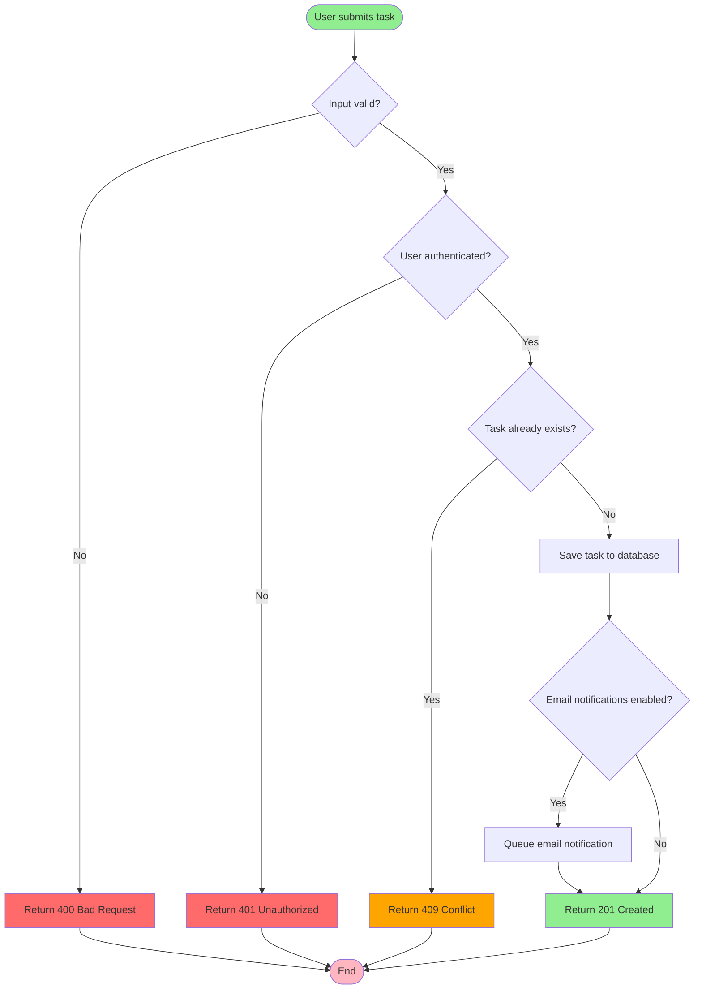

---

## 8. User Journey Diagrams

**PURPOSE**: Show user interaction flow through the application.

**WHEN**: New features, UX design, onboarding flows.

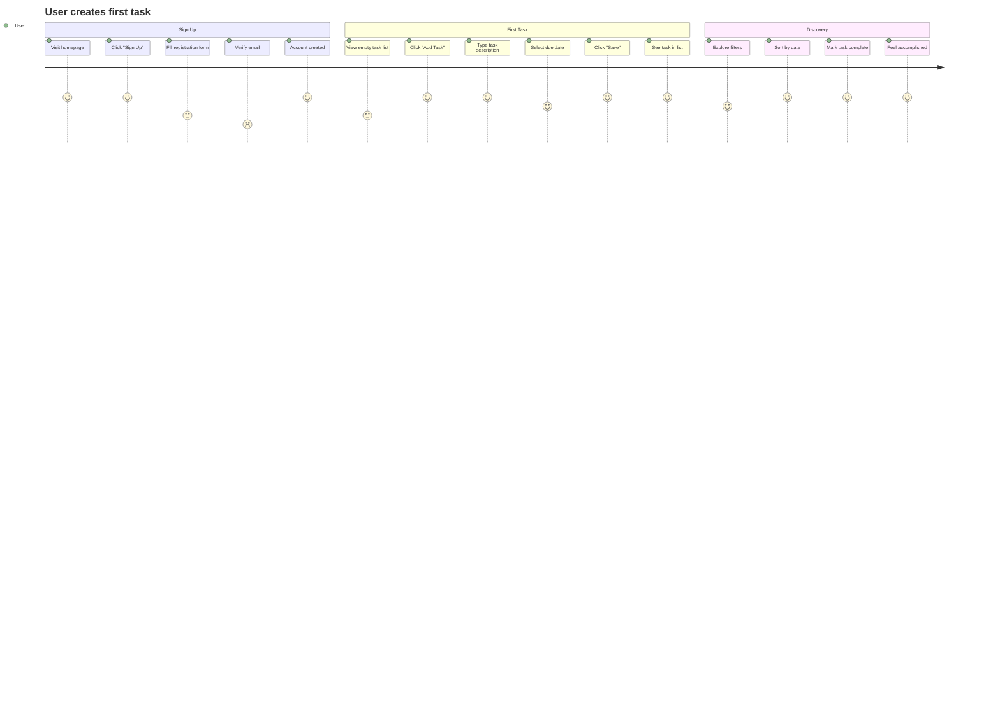

**Scoring**:
- 1 = Very unhappy/frustrated
- 3 = Neutral
- 5 = Very happy/delighted

---

## 9. Git Branching Diagram

**PURPOSE**: Show branching strategy and workflow.

**WHEN**: Documenting Git workflow, onboarding new developers.

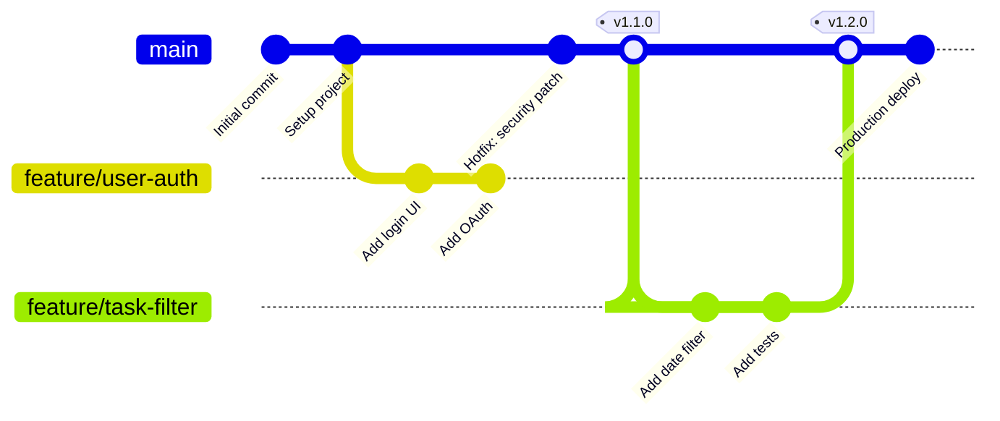

---

## Diagram Style Guidelines

### Naming Conventions

✅ **GOOD**:
```
User
TaskService
PostgreSQL Database
HTTP API Server
```

❌ **BAD**:
```
user (not capitalized)
task_service (snake_case)
db (not descriptive)
server (ambiguous)
```

### Node Labels

Include both name and technology:
```
API Server
Bun HTTP
Port 4000
```

### Arrows and Relationships

Use descriptive verbs on arrows:
```
User -->|Creates| Task
API -->|Queries| Database
Client -->|Sends HTTP POST| Server
```

### Colors and Styling

Use consistent colors:
- **System Boundary**: Blue (#1168bd)
- **User/Actor**: Dark Blue (#08427b)
- **Database**: Purple (#3b48cc)
- **External Service**: Gray (#999999)
- **Success State**: Green (#90EE90)
- **Error State**: Red (#FF6B6B)
- **Warning State**: Orange (#FFA500)

---

## Documentation Location

**RULE**: Store diagrams in `docs/diagrams/` organized by type.

```
docs/diagrams/
├── architecture/
│   ├── system-context.md
│   ├── container-diagram.md
│   └── component-diagrams.md
├── flows/
│   ├── api-request-flows.md
│   ├── authentication-flow.md
│   └── task-creation-flow.md
├── database/
│   └── schema-erd.md
└── workflows/
    ├── git-workflow.md
    └── user-journeys.md
```

---

## When to Create Diagrams

**REQUIRED**:
- New project setup (system context)
- Major architecture changes (container, component)
- New API endpoints (sequence)
- Database schema changes (ERD)
- Complex business logic (flowchart)
- Workflow changes (state machine)

**OPTIONAL** (but recommended):
- User onboarding flows (user journey)
- Complex algorithms (flowchart)
- Multi-service interactions (sequence)

---

## Diagram Review Checklist

Before merging diagrams:

- [ ] Uses Mermaid syntax (not external tool)
- [ ] Renders correctly on GitHub
- [ ] Labels are clear and descriptive
- [ ] Arrows have descriptive text
- [ ] Consistent naming conventions
- [ ] Consistent color scheme
- [ ] Appropriate level of detail (not too much, not too little)
- [ ] Updated to reflect current code
- [ ] Stored in correct location
- [ ] Referenced from related documentation

---

## Tools for Editing

Recommended editors for Mermaid diagrams:

1. **VS Code** — with Mermaid extension (live preview)
2. **Mermaid Live Editor** — https://mermaid.live (online)
3. **GitHub** — renders automatically in Markdown files
4. **IntelliJ/WebStorm** — built-in Mermaid support

---

## Summary

Diagrams are living documentation that evolves with the code. Keep them simple, clear, and up-to-date to maximize their value.
